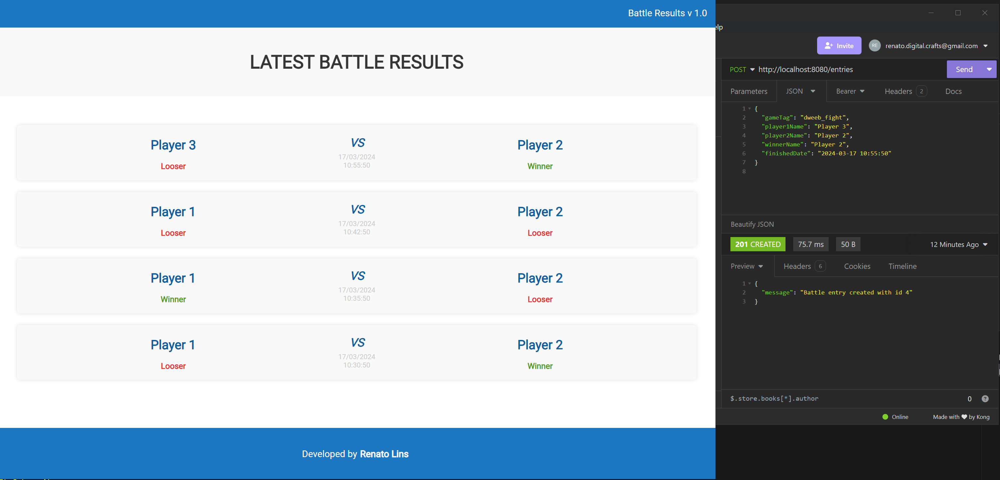

# Battle Results - Made with Flask

### About this project

This project aims to develop a REST API using Flask + SQLAlchemy for managing game battle results, displaying entries from newest to oldest. The goal is to integrate backend functionality into my game projects and highlight Python code in my portfolio.

### Technologies used

* Sass for styling
* SQLAlchemy as the ORM
* SQLite as the database
* Python as the backend language
* Flask as the backend web framework
* Jinja2 as a template engine for back-end UI rendering
* Swagger UI for API documentation

### How it looks after adding a few battle entries



---

## Quick Start

1. **Set up environment variables**
   Create a `.env` file with required configuration (see [Setup Guide](docs/setup.md))

2. **Install dependencies**
   ```bash
   pip install pipenv
   pipenv install
   pipenv shell
   ```

3. **Run the application**
   ```bash
   python app.py
   ```

4. **Access the application**
   - Web interface: http://localhost:8080
   - API documentation: http://localhost:8080/api/docs

## Documentation

For complete documentation, please refer to the [`docs`](docs) folder:

- [Setup Guide](docs/setup.md) - Detailed instructions for setting up the project
- [API Documentation](docs/api.md) - Comprehensive API documentation
- [Deployment Guide](docs/deployment.md) - Options for deploying the application
- [Best Practices](docs/best_practices.md) - Recommended practices for development

## Testing

Run the test suite with:

```bash
python run_tests.py
```

For test coverage reporting:

```bash
python run_tests.py --coverage
```

## License

This project is open source and available under the terms of the license included in the repository.

## API Overview

The API provides endpoints for managing battle entries:

- **GET /entries** - List all battle entries
- **POST /entries** - Create a new battle entry
- **GET /entries/{id}** - Get a specific battle entry
- **PATCH /entries/{id}** - Update a battle entry
- **DELETE /entries/{id}** - Delete a battle entry

For detailed API documentation, see the [API Documentation](docs/api.md) or access the Swagger UI at `/api/docs` when the application is running.

## Docker Support

The application includes Docker support for easy deployment:

```bash
# Build and start with Docker Compose
docker-compose up -d
```

For more deployment options, see the [Deployment Guide](docs/deployment.md).

