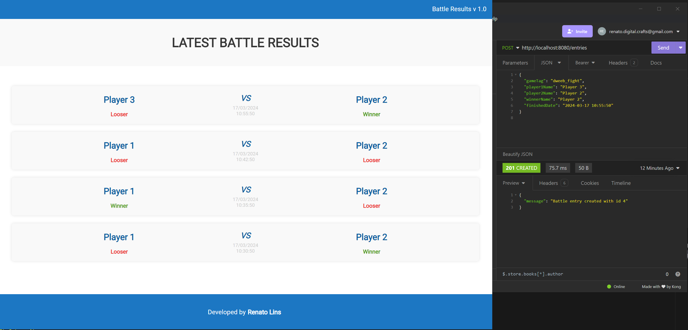

# Battle Results Flask

REST API and minimal web UI for tracking game battle results, built with Flask and SQLAlchemy. Entries are always displayed from newest to oldest.



## Main Stack

- **Python 3.13** — Backend runtime
- **Flask** — Web framework handling routing, request lifecycle and WSGI serving
- **SQLAlchemy** — ORM backed by SQLite; database and tables are created automatically on first run
- **Jinja2** — Server-side HTML templating for the web UI
- **SASS** — Component-level styling compiled and bundled via Flask-Assets

## Tools & Libraries

- **Pipenv** — Dependency management and reproducible virtual environments
- **Flask-Assets** — Asset pipeline: compiles SASS to CSS and bundles JS/CSS for the browser
- **Swagger UI** — Interactive API documentation served at `/api/docs`, driven by `static/swagger.json`
- **unittest** — Standard-library test framework used for API and view tests
- **pytest** — Used alongside unittest for view tests
- **coverage** — Test coverage reporting

## Running the Project

Dependencies are managed with **Pipenv**, which creates an isolated virtual environment automatically. Nothing is installed globally.

**1. Install Pipenv** *(once, globally)*

```bash
pip install pipenv
```

> On Windows, `pipenv` may not be available as a bare command after installation. Use `python -m pipenv` as a drop-in replacement for all commands below if that happens.

**2. Create the virtual environment and install dependencies**

```bash
python -m pipenv install
```

This creates a `.venv` inside the project and installs all packages from `Pipfile.lock` into it.

**3. Configure environment variables**

```bash
cp .env.example .env
```

Open `.env` and set `FLASK_SECRET_KEY` to a strong random value. If not set, a temporary key is auto-generated and sessions won't survive restarts. Generate one with:

```bash
python -c "import secrets; print(secrets.token_hex(32))"
```

**4. Activate the virtual environment and run**

```bash
python -m pipenv shell       # activates the venv in a new subshell
python app.py
```

Or run without activating the shell:

```bash
python -m pipenv run python app.py
```

Open [http://localhost:8080](http://localhost:8080) to view the web UI.  
API docs are at [http://localhost:8080/api/docs](http://localhost:8080/api/docs).

> To exit the virtual environment shell, run `exit`.

## Docker

Use Docker when you want to run the app without installing Python or Pipenv locally, or when deploying to a server or CI environment. The container bundles all dependencies and runs the app in an isolated, reproducible environment.

```bash
# Set the secret key, then build and start
export FLASK_SECRET_KEY=$(python -c "import secrets; print(secrets.token_hex(32))")
docker compose up --build -d
```

Or create a `.env` file in the project root (read automatically by Compose):

```dotenv
FLASK_SECRET_KEY=replace_with_a_long_random_string
FLASK_DEBUG=False
LOCAL_DATABASE_PATH=data
```

The SQLite database is stored in `./data/` on the host and survives restarts and rebuilds.

See [docs/docker.md](docs/docker.md) for the full guide: all commands, environment variables, data persistence, production setup and troubleshooting.

## Technical Implementations

- ✅ Layered architecture: routes → controllers → ORM models with clear separation of concerns
- ✅ SQLAlchemy ORM with auto-created SQLite database and tables on startup
- ✅ Flask-Assets pipeline compiling SASS and bundling static assets at runtime
- ✅ OpenAPI spec (`swagger.json`) served through Swagger UI for interactive exploration
- ✅ Environment-based configuration via env vars with sensible fallback defaults
- ✅ Dockerized with non-root user, host-mounted database volume and `restart: unless-stopped`
- ✅ API and view test suites with optional coverage reporting

## Features

- ✅ Create, list, retrieve, partially update and delete battle entries
- ✅ Entries displayed newest-first in both the API response and web UI
- ✅ Field validation: player names must differ, winner must be one of the two players, `gameTag` is immutable after creation
- ✅ Interactive API documentation at `/api/docs` (Swagger UI)
- ✅ PATCH support for all mutable fields including `finishedDate`

## API

| Method | Path | Description |
|---|---|---|
| GET | `/entries` | List all entries (newest first) |
| POST | `/entries` | Create a new entry |
| GET | `/entries/<id>` | Get a single entry |
| PATCH | `/entries/<id>` | Partially update an entry |
| DELETE | `/entries/<id>` | Delete an entry |

**POST / PATCH payload fields**

| Field | Type | Notes |
|---|---|---|
| `gameTag` | string | max 100 chars; immutable after creation |
| `player1Name` | string | max 100 chars |
| `player2Name` | string | max 100 chars; must differ from `player1Name` |
| `winnerName` | string | must equal `player1Name` or `player2Name` |
| `finishedDate` | string | PATCH only; format `YYYY-MM-DD HH:MM:SS` |

## Development

### Available Scripts

```bash
# Local development
python app.py                    # Start the development server (http://localhost:8080)

# Testing
python run_tests.py              # Run all tests
python run_tests.py --coverage   # Run tests with coverage report

# Docker
docker compose up --build        # Build image and start in the foreground
docker compose up --build -d     # Build image and start in the background
docker compose logs -f           # Follow container logs
docker compose exec web sh       # Open a shell inside the running container
docker compose stop              # Stop containers (keeps data)
docker compose down              # Stop and remove containers (data in ./data is kept)
```

## License

See [LICENSE](LICENSE).
